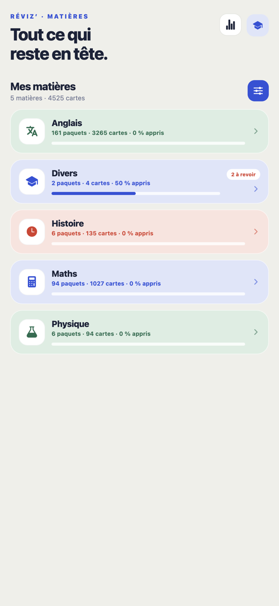
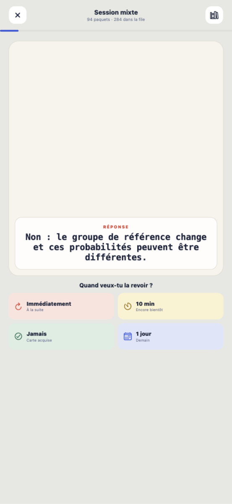

# Réviz’

**Des fiches de révision pour le collège et le lycée, dans ta poche.**

Réviz’ est une application de révision par cartes (flashcards) pour les élèves de la 6e à la Terminale. Les paquets couvrent les maths, l’anglais, le français et l’histoire : lance une courte session, réponds aux cartes du jour, et l’application te proposera de revoir chaque carte au bon moment.

<p align="center">
  
  &nbsp;
  
  &nbsp;
  
</p>

## Comment ça marche ?

1. **Choisis un paquet** dans l’arbre de progression (par matière et par niveau), ou lance une session mixte.
2. **Réponds aux cartes du jour** : formule ta réponse, retourne la carte, compare.
3. **Évalue-toi** : la carte revient immédiatement, demain ou plus tard selon ton niveau de certitude.
4. **Reviens chaque jour** : les cartes se présentent au moment où tu risques de les oublier.

## Ce que tu peux faire

- réviser par matière et par niveau (6e à Terminale) grâce à l’arbre de progression ;
- lancer une session sur un paquet ou sur plusieurs paquets à la fois ;
- lire les formules mathématiques en LaTeX, rendues avec KaTeX ;
- créer, modifier et supprimer tes propres cartes ;
- suivre ta progression globale et masquer les paquets déjà maîtrisés ;
- synchroniser les paquets depuis le dépôt GitHub, ou réviser hors ligne ;
- régler les délais de révision et le nombre de cartes par session.

## Les paquets

Les paquets sont des fichiers JSON versionnés dans le dossier [`decks/`](./decks), organisés par matière (`maths`, `anglais`, `francais`, `histoire`). L’application les télécharge depuis le dépôt GitHub : pas besoin de compte, ni de serveur dédié. Les scripts Python du dossier [`scripts/`](./scripts) permettent de générer et de valider les paquets.

Pour contribuer un paquet, ajoute un fichier JSON au bon endroit, valide-le avec le script adapté, puis ouvre une pull request.

## Tes données restent sur ton appareil

Ta progression est enregistrée localement (SQLite). Réviz’ ne nécessite pas de compte et n’envoie aucune donnée personnelle vers un service distant : seule la synchronisation des paquets interroge GitHub, en lecture seule.

## Installation

### Android

Télécharge la dernière version depuis la page des [versions de Réviz’](https://github.com/bhamon-lab/flashcard/releases/latest), puis ouvre le fichier APK sur ton téléphone.

Android peut demander l’autorisation d’installer une application provenant de ton navigateur ou de ton gestionnaire de fichiers.

### iPhone et développement

Il n’existe pas encore de version distribuée sur l’App Store. Pour essayer Réviz’ depuis le code source, consultez la section destinée aux contributeurs ci-dessous.

<details>
<summary><strong>Lancer le projet depuis le code source</strong></summary>

Le projet utilise Expo SDK 57. Après avoir installé Node.js :

```bash
npm install
npm start
```

Scannez le QR code avec Expo Go, ou appuyez sur `i`, `a` ou `w` pour ouvrir respectivement les versions iOS, Android ou web.

</details>

<details>
<summary><strong>Publier une version Android</strong></summary>

La CI construit automatiquement l’APK signé lorsqu’un tag `vX.Y.Z` est poussé :

1. le tag déclenche le workflow `android-release.yml` ;
2. ce workflow lance `publish-android-release.yml` sur la branche par défaut ;
3. le workflow met à jour la version depuis le tag, construit l’APK signé (Gradle + keystore fourni par les secrets du dépôt) et publie une release GitHub avec l’APK.

</details>

## Licence

Réviz’ est distribué sous [licence MIT](./LICENSE).
