# Mathématiques du collège — 2026-2027

38 decks et 373 cartes, classés de la 6e à la 3e. Chaque carte porte sur une formule, une définition, une propriété ou une méthode générale. Une seule notion est demandée à la fois, avec une réponse courte et les conditions utiles. Les exercices chiffrés et les mises en situation ont été retirés. Les thèmes restent : nombres et calculs, algèbre, proportionnalité et fonctions, géométrie, grandeurs, données, probabilités et algorithmique.

## Références et périmètre

Le millésime est celui de l’année scolaire 2026-2027 en France. Les contenus de 6e suivent le programme de 2025, ceux de 5e le programme de 2026. Les classes de 4e et 3e utilisent encore le programme de 2020 et ses attendus annuels : les nouveaux programmes ne s’y appliquent respectivement qu’en septembre 2027 et septembre 2028.

Calendrier officiel : [Éduscol — cycle 4](https://eduscol.education.gouv.fr/5736/ressources-d-accompagnement-du-programme-de-mathematiques-au-cycle-4). Références consultées le 12 septembre 2026 :

- [Programme cycle 3, BO du 17 avril 2025 — sixième](https://www.education.gouv.fr/sites/default/files/programme-de-math-matiques-pour-le-cycle-3-439827.pdf) — identifiant `cycle3-2025`.
- [Programme cycle 4, BO du 5 mars 2026 — cinquième](https://www.education.gouv.fr/sites/default/files/document/Annexe%202%20%E2%80%93%20Programme%20de%20math%C3%A9matiques%20pour%20le%20cycle%204-480716.pdf) — identifiant `cycle4-2026-5e`.
- [Attendus annuels de quatrième, programme 2020](https://eduscol.education.gouv.fr/sites/default/files/document/16-maths-4e-attendus-eduscol1114746pdf-74682.pdf) — identifiant `attendus-4e-2020`.
- [Attendus annuels de troisième, programme 2020](https://eduscol.education.gouv.fr/sites/default/files/document/18-maths-3e-attendus-eduscol1114748pdf-74688.pdf) — identifiant `attendus-3e-2020`.

Le [catalogue structuré](../curriculum/maths.json) (section collège du fichier de la matière) associe chaque deck à une référence, une rubrique du programme et ses prérequis. Ce découpage et les liens de progression sont des choix pédagogiques, pas un ordre de chapitres imposé par les textes officiels.

Les cartes servent à mémoriser les essentiels du programme. Exemples : « Aire d’un triangle de base b et de hauteur h ? » → « A = bh/2 » ; « Produit de deux nombres non nuls de même signe ? » → « Positif ». Les propriétés gardent leurs conditions d’application. La pratique des exercices et des constructions relève d’un entraînement complémentaire.

Points de progressivité pris en compte :

- 6e : fractions comme quotients, pourcentages, somme des angles du triangle, cercle circonscrit, premières probabilités et pensée pré-algébrique. Les lettres sont expliquées dans des situations concrètes.
- 5e 2026 : carrés et cubes, fractions de dénominateurs quelconques, distributivité, premières équations par opérations inverses, hauteurs et médianes des triangles. Les variables informatiques restent des données saisies en lecture.
- 4e : Thalès en triangles emboîtés et cosinus sont déjà introduits ; s’y ajoutent médiane, événements contraires, pyramides et cônes.
- 3e : Thalès en configuration papillon, triangles semblables, sinus et tangente, fonctions affines, équations produits et expériences à deux étapes. Les carrés de sommes sont développés par distributivité.

## Inventaire

| Classe | Decks | Cartes |
| --- | ---: | ---: |
| 6e | 8 | 85 |
| 5e | 10 | 92 |
| 4e | 10 | 97 |
| 3e | 10 | 99 |

### 6e

| Deck | Cartes | Référence dans le programme |
| --- | ---: | --- |
| [Entiers et décimaux](../decks/maths/6e-nombres.json) | 10 | Nombres entiers et décimaux, p. 13-14 |
| [Opérations et vocabulaire](../decks/maths/6e-operations.json) | 10 | Nombres entiers et décimaux, p. 13-14 |
| [Fractions et quotients](../decks/maths/6e-fractions.json) | 12 | Fractions, p. 14-15 |
| [Proportionnalité et pourcentages](../decks/maths/6e-proportionnalite.json) | 10 | Fractions : pourcentages ; Proportionnalité, p. 15 et 27 |
| [Distances, angles et triangles](../decks/maths/6e-geometrie.json) | 13 | Configurations planes, p. 22-23 |
| [Mesures, symétrie et espace](../decks/maths/6e-mesures-espace.json) | 12 | Grandeurs et mesures ; symétrie axiale ; vision dans l’espace |
| [Données et hasard](../decks/maths/6e-donnees-hasard.json) | 10 | Organisation et gestion de données et probabilités, p. 25-26 |
| [Égalités, motifs et instructions](../decks/maths/6e-algebre-algorithmes.json) | 8 | Algèbre ; Initiation à la pensée informatique |

### 5e

| Deck | Cartes | Référence dans le programme |
| --- | ---: | --- |
| [Priorités, divisibilité et puissances](../decks/maths/5e-operations-puissances.json) | 10 | Opérations ; Puissances, p. 7-8 |
| [Nombres relatifs et repérage](../decks/maths/5e-relatifs.json) | 10 | Nombres relatifs ; repérage dans le plan, p. 7 et 12 |
| [Comparer et additionner les fractions](../decks/maths/5e-fractions.json) | 8 | Nombres rationnels, p. 8 |
| [Lettres, formules et premières équations](../decks/maths/5e-calcul-litteral.json) | 10 | Calcul littéral et algébrique, p. 8-9 |
| [Proportions, échelles et dépendances](../decks/maths/5e-proportionnalite.json) | 8 | Proportionnalité et fonctions, p. 18-19 |
| [Triangles et droites remarquables](../decks/maths/5e-triangles-angles.json) | 10 | Angles et triangles, p. 13 |
| [Parallélogrammes et symétrie centrale](../decks/maths/5e-parallelogrammes.json) | 10 | Transformations ; parallélogrammes, p. 12-13 |
| [Disques, prismes et cylindres](../decks/maths/5e-solides.json) | 10 | Représentation de l’espace, p. 12 |
| [Statistiques et probabilités](../decks/maths/5e-statistiques-probabilites.json) | 8 | Statistiques et probabilités, p. 16-17 |
| [Entrées, sorties et répétitions](../decks/maths/5e-algorithmique.json) | 8 | Pensée informatique, p. 20 |

### 4e

| Deck | Cartes | Référence dans le programme |
| --- | ---: | --- |
| [Calcul avec les relatifs et les fractions](../decks/maths/4e-relatifs-fractions.json) | 10 | Nombres et calcul exact, p. 2-3 |
| [Puissances, écriture scientifique et racines](../decks/maths/4e-puissances-racines.json) | 12 | Nombres et comparaison, p. 2 |
| [Nombres premiers et décomposition](../decks/maths/4e-arithmetique.json) | 8 | Divisibilité et nombres premiers, p. 3-4 |
| [Développement, factorisation et équations](../decks/maths/4e-equations.json) | 10 | Calcul littéral, p. 4 |
| [Pythagore et cosinus](../decks/maths/4e-pythagore-cosinus.json) | 10 | Géométrie plane, p. 9-10 |
| [Thalès, triangles égaux et translations](../decks/maths/4e-thales-translations.json) | 9 | Géométrie plane et transformations, p. 8-10 |
| [Volumes, vitesses et agrandissements](../decks/maths/4e-grandeurs-espace.json) | 12 | Grandeurs et espace, p. 8-9 |
| [Proportionnalité et relations entre grandeurs](../decks/maths/4e-proportionnalite.json) | 8 | Proportionnalité et notion de fonction, p. 6-7 |
| [Médiane et événements contraires](../decks/maths/4e-statistiques-probabilites.json) | 8 | Statistiques et probabilités, p. 5-6 |
| [Variables, conditions et boucles](../decks/maths/4e-algorithmique.json) | 10 | Algorithmique et programmation, p. 11-12 |

### 3e

| Deck | Cartes | Référence dans le programme |
| --- | ---: | --- |
| [Arithmétique et nombres rationnels](../decks/maths/3e-arithmetique.json) | 10 | Nombres, calcul et divisibilité, p. 2-3 |
| [Calcul littéral et factorisation](../decks/maths/3e-calcul-litteral.json) | 9 | Calcul littéral, p. 3 |
| [Équations : règles générales](../decks/maths/3e-equations.json) | 9 | Équations, p. 3 |
| [Fonctions, images et antécédents](../decks/maths/3e-fonctions.json) | 10 | Notion de fonction, p. 5-6 |
| [Fonctions affines et pourcentages](../decks/maths/3e-affines-pourcentages.json) | 12 | Fonctions linéaires et affines ; proportionnalité, p. 5-6 |
| [Thalès et triangles semblables](../decks/maths/3e-thales-similitude.json) | 9 | Thalès et triangles semblables, p. 8 |
| [Trigonométrie dans le triangle rectangle](../decks/maths/3e-trigonometrie.json) | 9 | Cosinus, sinus et tangente, p. 8 |
| [Transformations, sphères et volumes](../decks/maths/3e-transformations-espace.json) | 11 | Grandeurs, transformations et espace, p. 7-8 |
| [Statistiques et expériences à deux étapes](../decks/maths/3e-statistiques-probabilites.json) | 10 | Statistiques et probabilités, p. 4-5 |
| [Programmes, boucles et simulations](../decks/maths/3e-algorithmique.json) | 10 | Algorithmique et programmation, p. 9-11 |

## Arbre de progression

Une flèche signifie « ce deck fournit des prérequis utiles pour le suivant ». Plusieurs branches peuvent être travaillées en parallèle et certains chapitres réunissent plusieurs prérequis. Les élèves peuvent entrer directement dans leur classe, puis revenir aux branches antérieures selon leurs besoins.

```mermaid
flowchart TD
  subgraph classe6e["6e"]
    n0["Entiers et décimaux"]
    n1["Opérations et vocabulaire"]
    n2["Fractions et quotients"]
    n3["Proportionnalité et pourcentages"]
    n4["Distances, angles et triangles"]
    n5["Mesures, symétrie et espace"]
    n6["Données et hasard"]
    n7["Égalités, motifs et instructions"]
  end
  subgraph classe5e["5e"]
    n8["Priorités, divisibilité et puissances"]
    n9["Nombres relatifs et repérage"]
    n10["Comparer et additionner les fractions"]
    n11["Lettres, formules et premières équations"]
    n12["Proportions, échelles et dépendances"]
    n13["Triangles et droites remarquables"]
    n14["Parallélogrammes et symétrie centrale"]
    n15["Disques, prismes et cylindres"]
    n16["Statistiques et probabilités"]
    n17["Entrées, sorties et répétitions"]
  end
  subgraph classe4e["4e"]
    n18["Calcul avec les relatifs et les fractions"]
    n19["Puissances, écriture scientifique et racines"]
    n20["Nombres premiers et décomposition"]
    n21["Développement, factorisation et équations"]
    n22["Pythagore et cosinus"]
    n23["Thalès, triangles égaux et translations"]
    n24["Volumes, vitesses et agrandissements"]
    n25["Proportionnalité et relations entre grandeurs"]
    n26["Médiane et événements contraires"]
    n27["Variables, conditions et boucles"]
  end
  subgraph classe3e["3e"]
    n28["Arithmétique et nombres rationnels"]
    n29["Calcul littéral et factorisation"]
    n30["Équations : règles générales"]
    n31["Fonctions, images et antécédents"]
    n32["Fonctions affines et pourcentages"]
    n33["Thalès et triangles semblables"]
    n34["Trigonométrie dans le triangle rectangle"]
    n35["Transformations, sphères et volumes"]
    n36["Statistiques et expériences à deux étapes"]
    n37["Programmes, boucles et simulations"]
  end
  n0 --> n1
  n1 --> n2
  n2 --> n3
  n1 --> n4
  n4 --> n5
  n3 --> n6
  n1 --> n7
  n4 --> n7
  n1 --> n8
  n0 --> n9
  n2 --> n10
  n8 --> n10
  n7 --> n11
  n8 --> n11
  n3 --> n12
  n11 --> n12
  n9 --> n12
  n4 --> n13
  n9 --> n13
  n5 --> n14
  n13 --> n14
  n5 --> n15
  n8 --> n15
  n6 --> n16
  n10 --> n16
  n7 --> n17
  n11 --> n17
  n9 --> n18
  n10 --> n18
  n8 --> n19
  n18 --> n19
  n8 --> n20
  n10 --> n20
  n11 --> n21
  n18 --> n21
  n13 --> n22
  n19 --> n22
  n12 --> n23
  n14 --> n23
  n15 --> n24
  n12 --> n24
  n12 --> n25
  n21 --> n25
  n16 --> n26
  n18 --> n26
  n17 --> n27
  n21 --> n27
  n20 --> n28
  n19 --> n28
  n21 --> n29
  n19 --> n29
  n29 --> n30
  n25 --> n31
  n30 --> n31
  n31 --> n32
  n12 --> n32
  n23 --> n33
  n30 --> n33
  n22 --> n34
  n30 --> n34
  n24 --> n35
  n23 --> n35
  n26 --> n36
  n27 --> n37
  n36 --> n37
```



Exemples de parcours ciblés :

- **Reprendre le calcul** : opérations 6e → fractions 6e → fractions 5e → calcul avec les fractions 4e.
- **Préparer les fonctions** : premières égalités 6e → calcul littéral 5e → équations 4e → équations 3e → fonctions et fonctions affines 3e.
- **Calculer des longueurs** : distances et triangles 6e → triangles 5e → Pythagore et cosinus 4e → trigonométrie 3e.
- **Comprendre le hasard** : données et hasard 6e → statistiques et probabilités 5e → médiane et événements contraires 4e → expériences à deux étapes 3e.

Le graphe est livré comme données et comme diagramme dans ce document. Son affichage interactif, le calcul de maîtrise par notion et le déverrouillage ne sont pas implémentés dans l’application. Les decks restent accessibles avec le fonctionnement actuel.

## Format et utilisation

Les fichiers dans `decks/maths/` suivent le [format de synchronisation existant](../decks/README.md). Les titres incluent la classe ; une couleur commune identifie chaque niveau. La limite initiale est de trois nouvelles cartes par jour et par deck. Elle reste réglable dans l’application.

Chaque carte possède un identifiant descriptif stable, `front`, `back` et un champ éditorial `kind` parmi `formule`, `definition`, `propriete`, `methode`. Les decks ajoutent `grade`, `school_year` et `curriculum_reference`. Le synchroniseur actuel ignore ces métadonnées supplémentaires et importe normalement les titres, cartes et formules ; elles documentent les contenus et permettent une évolution ultérieure.

Cette réécriture remplace les anciennes cartes par de nouveaux identifiants préfixés `rappel-`. Leur apprentissage repart donc à zéro à la synchronisation, au lieu de réutiliser les résultats des anciens exercices. Les identifiants de decks et leurs liens de prérequis sont conservés.

Le catalogue est placé dans `curriculum/`, hors du dossier synchronisé, pour ne pas être interprété comme un paquet de cartes. Les decks de lycée déjà présents sont conservés.

Les fichiers sont ajoutés au dépôt local. La synchronisation mobile les récupérera après publication sur la branche configurée par le mécanisme existant ; la génération seule ne les publie pas.

Pour réviser, réciter la formule ou la règle avant de retourner la carte, puis vérifier aussi ses conditions d’application. Quelques decks actifs suffisent pour commencer ; la limite quotidienne s’applique séparément à chaque paquet.

## Contrôles

Exécuter depuis le projet :

```sh
python3 scripts/validate_college_decks.py
```

Le validateur contrôle les JSON, les identifiants uniques, les textes non vides, les types de rappel autorisés, les références, les comptes par deck, les délimiteurs mathématiques et les prérequis (existence, cohérence des niveaux, absence de cycle). Il inclut la recherche de collisions avec les decks préexistants.

Les formules ont aussi été compilées avec KaTeX 0.16.22, la version utilisée dans `src/MathView.tsx`. Ces contrôles techniques ne constituent pas une preuve automatique de la justesse pédagogique : les calculs et les conditions d’application des propriétés ont fait l’objet d’une relecture.
