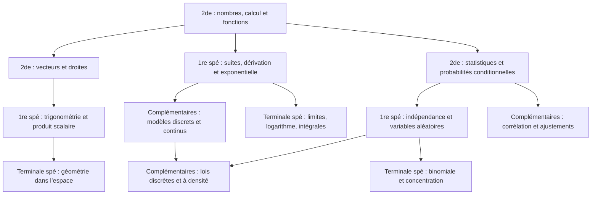

# Mathématiques du lycée — 2026-2027

Des cartes de rappel : une formule, une définition, une propriété ou une méthode générale par carte. Les constantes usuelles et les valeurs trigonométriques remarquables sont des connaissances à mémoriser ; il n’y a pas de problèmes chiffrés à résoudre.

Les decks couvrent les principaux repères de cours des quatre parcours. Ils accompagnent le cours et ne constituent pas une couverture exhaustive des compétences du programme (démonstrations, résolution de problèmes, modélisation et travaux pratiques).

## Périmètre et sources

La seconde est la seconde générale et technologique ; la première et la terminale spécialité relèvent de la voie générale. Les mathématiques complémentaires sont l’option de terminale générale.

Pour 2026-2027, les nouveaux programmes de seconde et première publiés le 2 avril 2026 s’appliquent. Les nouveaux programmes de terminale s’appliqueront en 2027-2028 : les deux parcours de terminale utilisent donc les programmes de 2019. Voir le [calendrier officiel](https://eduscol.education.gouv.fr/5817/programmes-et-ressources-en-mathematiques-voie-gt).

- [Seconde générale et technologique — BO du 2 avril 2026](https://www.education.gouv.fr/sites/default/files/document/Annexe%20%E2%80%93%20Programme%20d%26%23039%3Benseignement%20de%20math%C3%A9matiques%20de%20la%20classe%20de%20seconde%20g%C3%A9n%C3%A9rale%20et%20technologique-515402.pdf)
- [Première spécialité — BO du 2 avril 2026](https://www.education.gouv.fr/sites/default/files/document/Annexe%20%E2%80%93%20Programme%20d%26%23039%3Benseignement%20de%20sp%C3%A9cialit%C3%A9%20de%20math%C3%A9matiques%20de%20la%20classe%20de%20premi%C3%A8re%20de%20la%20voie%20g%C3%A9n%C3%A9rale-515408.pdf)
- [Terminale spécialité — BO spécial du 25 juillet 2019](https://eduscol.education.gouv.fr/sites/default/files/document/spe246annexe1158907pdf-84159.pdf)
- [Terminale mathématiques complémentaires — BO spécial du 25 juillet 2019](https://eduscol.education.gouv.fr/sites/default/files/document/spe265annexe1159134pdf-84162.pdf)

Le [catalogue de progression](../curriculum/maths.json) (section lycée du fichier de la matière) référence, pour chaque deck, la source officielle et ses rubriques. Il s’agit d’un choix éditorial de prérequis, pas d’un ordre imposé par les programmes.

## Répartition

| Parcours | Decks | Cartes |
| --- | ---: | ---: |
| 2de | 12 | 123 |
| 1re spé | 11 | 122 |
| Terminale spé | 16 | 161 |
| Terminale complémentaires | 15 | 139 |
| **Total** | **54** | **545** |

## Exemples de cartes

| Parcours | Recto | Verso |
| --- | --- | --- |
| 2de | Comment factoriser $a^2-b^2$ ? | $(a-b)(a+b)$ |
| 1re spé | Quelle est la dérivée de $e^x$ ? | $e^x$ |
| Terminale spé | Quelle est la dérivée de $\ln x$ ? | $1/x$, pour $x>0$. |
| Terminale complémentaires | Quelle est l’espérance de la loi exponentielle de paramètre $\lambda>0$ ? | $1/\lambda$ |

Les conditions nécessaires restent sur chaque carte. Les identifiants sont propres au deck : les rappels communs aux deux parcours de terminale ont chacun leur progression de révision.

## Vue générale de la progression



Les deux parcours de terminale partent des acquis de première spécialité. Aucun deck de maths complémentaires ne dépend d’un deck de terminale spécialité, ni l’inverse. Les rappels de première restent accessibles pour reprendre une notion. Les decks de logique et Python constituent une branche transversale.

Le graphe est documenté dans le JSON ; il n’est pas affiché dans l’application et ne verrouille aucun contenu.

## Inventaire et prérequis détaillés

### 2de

| Deck | Cartes | Prérequis conseillés |
| --- | ---: | --- |
| [Nombres et arithmétique](../decks/maths/2de-nombres.json) | 10 | Acquis du collège |
| [Intervalles et valeur absolue](../decks/maths/2de-intervalles.json) | 10 | 2de · Nombres et arithmétique |
| [Calcul littéral](../decks/maths/2de-calcul-litteral.json) | 12 | 2de · Nombres et arithmétique |
| [Équations, inéquations et signes](../decks/maths/2de-equations.json) | 10 | 2de · Calcul littéral, 2de · Intervalles et valeur absolue |
| [Fonctions et variations](../decks/maths/2de-fonctions.json) | 11 | 2de · Intervalles et valeur absolue, 2de · Équations, inéquations et signes |
| [Fonctions de référence](../decks/maths/2de-fonctions-reference.json) | 10 | 2de · Fonctions et variations |
| [Vecteurs du plan](../decks/maths/2de-vecteurs.json) | 10 | 2de · Calcul littéral |
| [Droites du plan](../decks/maths/2de-droites.json) | 8 | 2de · Vecteurs du plan, 2de · Équations, inéquations et signes |
| [Proportions et évolutions](../decks/maths/2de-pourcentages.json) | 9 | 2de · Calcul littéral |
| [Statistiques et tableaux croisés](../decks/maths/2de-statistiques.json) | 11 | 2de · Proportions et évolutions |
| [Probabilités et arbres](../decks/maths/2de-probabilites.json) | 12 | 2de · Intervalles et valeur absolue, 2de · Statistiques et tableaux croisés |
| [Logique et bases de Python](../decks/maths/2de-logique-python.json) | 10 | Acquis du collège |

### 1re spé

| Deck | Cartes | Prérequis conseillés |
| --- | ---: | --- |
| [Second degré](../decks/maths/1re-spe-second-degre.json) | 16 | 2de · Équations, inéquations et signes, 2de · Fonctions de référence |
| [Suites arithmétiques et géométriques](../decks/maths/1re-spe-suites.json) | 13 | 2de · Proportions et évolutions, 2de · Fonctions et variations |
| [Formules de dérivation](../decks/maths/1re-spe-derivees.json) | 12 | 2de · Fonctions de référence, 2de · Calcul littéral |
| [Tangentes, variations et symétries](../decks/maths/1re-spe-tangentes-variations.json) | 12 | 1re spé · Formules de dérivation |
| [Fonction exponentielle](../decks/maths/1re-spe-exponentielle.json) | 11 | 1re spé · Formules de dérivation, 1re spé · Suites arithmétiques et géométriques |
| [Cercle trigonométrique](../decks/maths/1re-spe-trigonometrie.json) | 14 | 2de · Vecteurs du plan |
| [Produit scalaire](../decks/maths/1re-spe-produit-scalaire.json) | 11 | 1re spé · Cercle trigonométrique, 2de · Vecteurs du plan |
| [Droites, cercles et projections](../decks/maths/1re-spe-geometrie-reperee.json) | 8 | 1re spé · Produit scalaire, 2de · Droites du plan |
| [Conditionnement et indépendance](../decks/maths/1re-spe-probabilites.json) | 9 | 2de · Probabilités et arbres |
| [Variables aléatoires](../decks/maths/1re-spe-variables-aleatoires.json) | 8 | 1re spé · Conditionnement et indépendance, 2de · Statistiques et tableaux croisés |
| [Python : listes et suites](../decks/maths/1re-spe-python-listes.json) | 8 | 2de · Logique et bases de Python, 1re spé · Suites arithmétiques et géométriques |

### Terminale spé

| Deck | Cartes | Prérequis conseillés |
| --- | ---: | --- |
| [Limites de suites et récurrence](../decks/maths/term-spe-suites-limites.json) | 14 | 1re spé · Suites arithmétiques et géométriques |
| [Limites et asymptotes](../decks/maths/term-spe-limites-fonctions.json) | 12 | 1re spé · Fonction exponentielle, 2de · Fonctions de référence |
| [Continuité et valeurs intermédiaires](../decks/maths/term-spe-continuite.json) | 8 | Terminale spé · Limites et asymptotes, 1re spé · Tangentes, variations et symétries |
| [Logarithme népérien](../decks/maths/term-spe-logarithme.json) | 14 | Terminale spé · Limites et asymptotes, 1re spé · Fonction exponentielle |
| [Dérivées de fonctions composées](../decks/maths/term-spe-derivees-composees.json) | 8 | 1re spé · Formules de dérivation, Terminale spé · Logarithme népérien |
| [Convexité](../decks/maths/term-spe-convexite.json) | 8 | Terminale spé · Dérivées de fonctions composées, 1re spé · Tangentes, variations et symétries |
| [Fonctions sinus et cosinus](../decks/maths/term-spe-trigonometrie.json) | 8 | 1re spé · Cercle trigonométrique, Terminale spé · Dérivées de fonctions composées |
| [Primitives usuelles](../decks/maths/term-spe-primitives.json) | 12 | Terminale spé · Dérivées de fonctions composées, Terminale spé · Fonctions sinus et cosinus |
| [Équations différentielles](../decks/maths/term-spe-equations-differentielles.json) | 8 | Terminale spé · Primitives usuelles, 1re spé · Fonction exponentielle |
| [Intégrales](../decks/maths/term-spe-integrales.json) | 10 | Terminale spé · Primitives usuelles, Terminale spé · Continuité et valeurs intermédiaires |
| [Dénombrement](../decks/maths/term-spe-denombrement.json) | 10 | 2de · Intervalles et valeur absolue, 1re spé · Conditionnement et indépendance |
| [Vecteurs et repères de l’espace](../decks/maths/term-spe-espace-vecteurs.json) | 8 | 1re spé · Produit scalaire |
| [Droites et plans de l’espace](../decks/maths/term-spe-espace-droites-plans.json) | 12 | Terminale spé · Vecteurs et repères de l’espace, 1re spé · Droites, cercles et projections |
| [Loi binomiale](../decks/maths/term-spe-binomiale.json) | 10 | Terminale spé · Dénombrement, 1re spé · Variables aléatoires |
| [Sommes, concentration et grands nombres](../decks/maths/term-spe-concentration.json) | 11 | Terminale spé · Loi binomiale, Terminale spé · Limites de suites et récurrence |
| [Méthodes algorithmiques](../decks/maths/term-spe-algorithmes.json) | 8 | 1re spé · Python : listes et suites, Terminale spé · Intégrales, Terminale spé · Limites de suites et récurrence |

### Terminale complémentaires

| Deck | Cartes | Prérequis conseillés |
| --- | ---: | --- |
| [Suites et modèles discrets](../decks/maths/term-complementaires-suites.json) | 12 | 1re spé · Suites arithmétiques et géométriques |
| [Logarithme népérien](../decks/maths/term-complementaires-logarithme.json) | 12 | 1re spé · Fonction exponentielle |
| [Limites et continuité](../decks/maths/term-complementaires-limites-continuite.json) | 10 | Terminale complémentaires · Logarithme népérien, 1re spé · Tangentes, variations et symétries |
| [Dérivation et variations](../decks/maths/term-complementaires-derivees.json) | 8 | Terminale complémentaires · Logarithme népérien, 1re spé · Formules de dérivation |
| [Convexité](../decks/maths/term-complementaires-convexite.json) | 8 | Terminale complémentaires · Dérivation et variations |
| [Primitives](../decks/maths/term-complementaires-primitives.json) | 8 | Terminale complémentaires · Dérivation et variations |
| [Équations différentielles](../decks/maths/term-complementaires-equations-differentielles.json) | 7 | Terminale complémentaires · Primitives |
| [Intégrales et valeur moyenne](../decks/maths/term-complementaires-integrales.json) | 9 | Terminale complémentaires · Primitives, Terminale complémentaires · Limites et continuité |
| [Conditionnement et probabilités inverses](../decks/maths/term-complementaires-conditionnement.json) | 8 | 1re spé · Conditionnement et indépendance |
| [Bernoulli et loi binomiale](../decks/maths/term-complementaires-binomiale.json) | 10 | Terminale complémentaires · Conditionnement et probabilités inverses, 1re spé · Variables aléatoires |
| [Lois uniforme discrète et géométrique](../decks/maths/term-complementaires-lois-discretes.json) | 9 | Terminale complémentaires · Bernoulli et loi binomiale |
| [Densités et loi uniforme continue](../decks/maths/term-complementaires-densites-uniforme.json) | 11 | Terminale complémentaires · Intégrales et valeur moyenne, Terminale complémentaires · Conditionnement et probabilités inverses |
| [Loi exponentielle](../decks/maths/term-complementaires-loi-exponentielle.json) | 8 | Terminale complémentaires · Densités et loi uniforme continue, Terminale complémentaires · Logarithme népérien |
| [Corrélation et ajustements](../decks/maths/term-complementaires-statistiques.json) | 11 | 2de · Statistiques et tableaux croisés, Terminale complémentaires · Logarithme népérien |
| [Méthodes algorithmiques](../decks/maths/term-complementaires-algorithmes.json) | 8 | 1re spé · Python : listes et suites, Terminale complémentaires · Intégrales et valeur moyenne, Terminale complémentaires · Équations différentielles |

## Intégration et validation

Les fichiers restent dans `decks/maths/`, au format déjà lu par le synchroniseur. Les titres indiquent le niveau et le parcours ; `grade` utilise les codes `2de`, `1re-spe`, `term-spe` et `term-complementaires`. Ces métadonnées éditoriales sont ignorées par le synchroniseur actuel.

Les cartes seront disponibles après intégration sur la branche par défaut et synchronisation de l’application.

```sh
python3 scripts/validate_lycee_decks.py
python3 scripts/validate_college_decks.py
```

Le validateur contrôle les identifiants, métadonnées, textes, effectifs et dépendances (références existantes, classes antérieures, absence de cycle et séparation des deux terminales). Le rendu des expressions LaTeX est également vérifié avec KaTeX 0.16.22 lors de la création. Ces contrôles techniques ne remplacent pas une relecture pédagogique.
